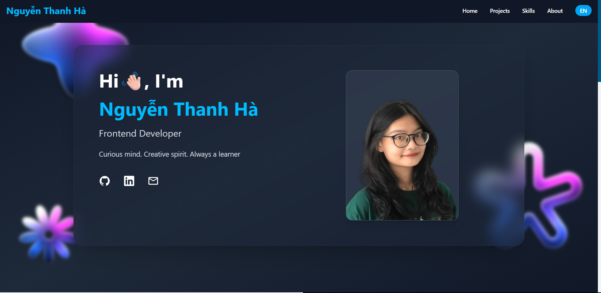

# Portfolio Project


A modern portfolio website built with React, TypeScript, and Vite, featuring Cloudinary integration for image management.
Live at: portfolio-hees-projects-ec9f5777.vercel.app

## Prerequisites

Before you begin, ensure you have the following installed:
- [Node.js](https://nodejs.org/) (v18 or higher)
- [Git](https://git-scm.com/)
- A [Cloudinary](https://cloudinary.com/) account

## Getting Started

### 1. Clone the Repository

```bash
git clone https://github.com/NguyenThanhHaa/PORTFOLIO.git
cd portfolio
```

### 2. Install Dependencies

```bash
npm install
```

### 3. Cloudinary Setup

1. Create a Cloudinary account at [cloudinary.com](https://cloudinary.com/) if you haven't already
2. Get your Cloudinary credentials from your dashboard:
   - Cloud Name
   - API Key
   - API Secret
3. Create a `.env` file in the root directory with the following variables:
   ```
   VITE_CLOUDINARY_CLOUD_NAME=your_cloud_name

   ```

### 4. Running the Project

#### Development Mode
```bash
npm run dev
```
This will start the development server at `http://localhost:5173`


## Available Scripts

- `npm run dev` - Start development server
- `npm run build` - Create production build
- `npm run preview` - Preview production build
- `npm run lint` - Run ESLint

## Technologies Used

- React 19
- TypeScript
- Vite
- TailwindCSS
- Cloudinary
- Framer Motion
- React Router DOM
- React Icons
- Swiper

## Contributing

1. Fork the repository
2. Create your feature branch (`git checkout -b feature/amazing-feature`)
3. Commit your changes (`git commit -m 'Add some amazing feature'`)
4. Push to the branch (`git push origin feature/amazing-feature`)
5. Open a Pull Request

## License

This project is licensed under the MIT License - see the [LICENSE](LICENSE) file for details.
